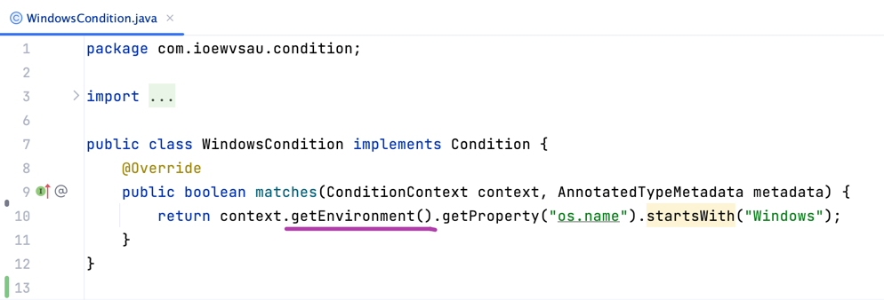
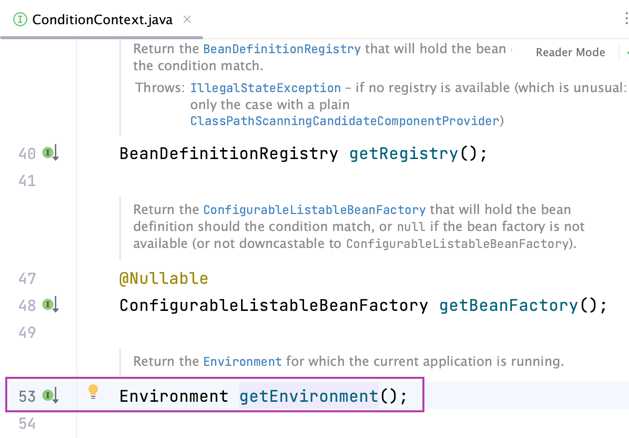
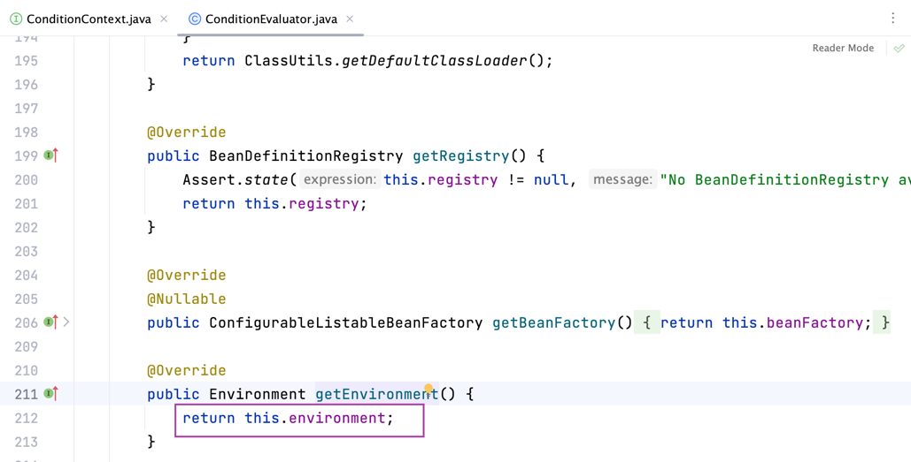
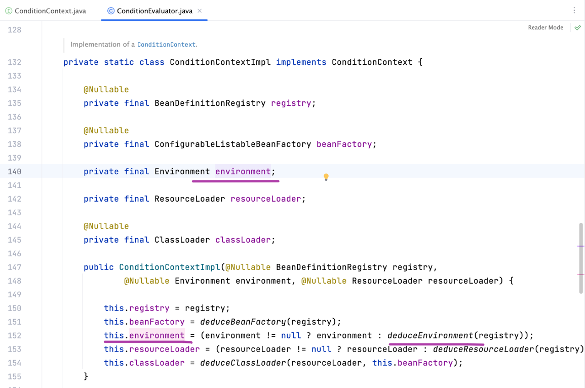
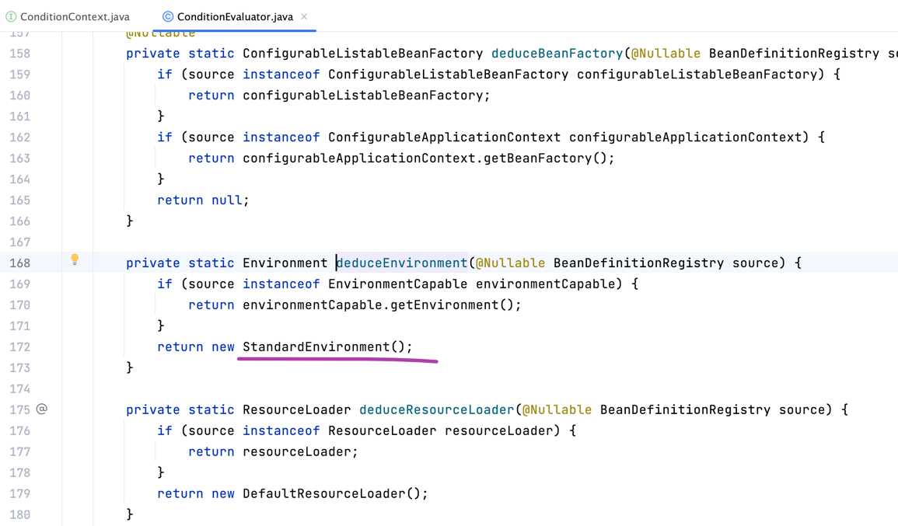
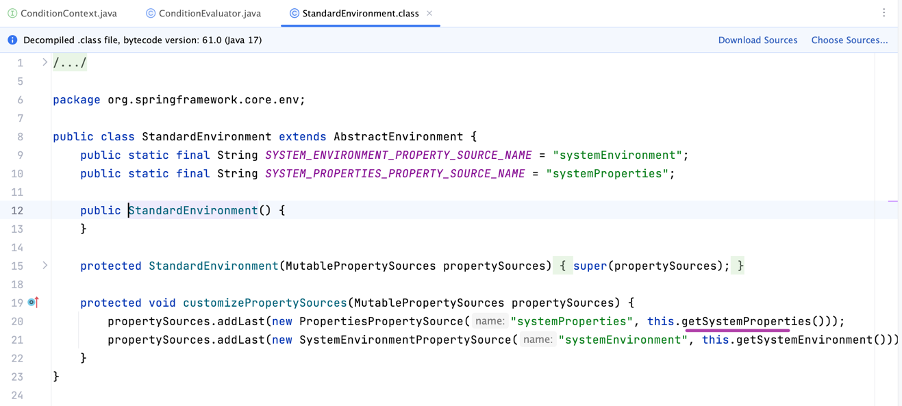
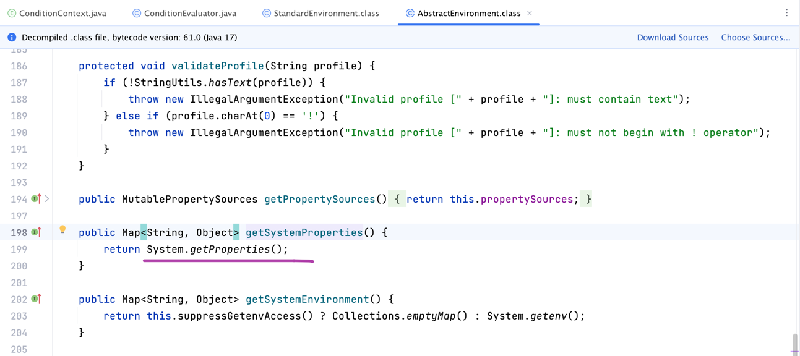
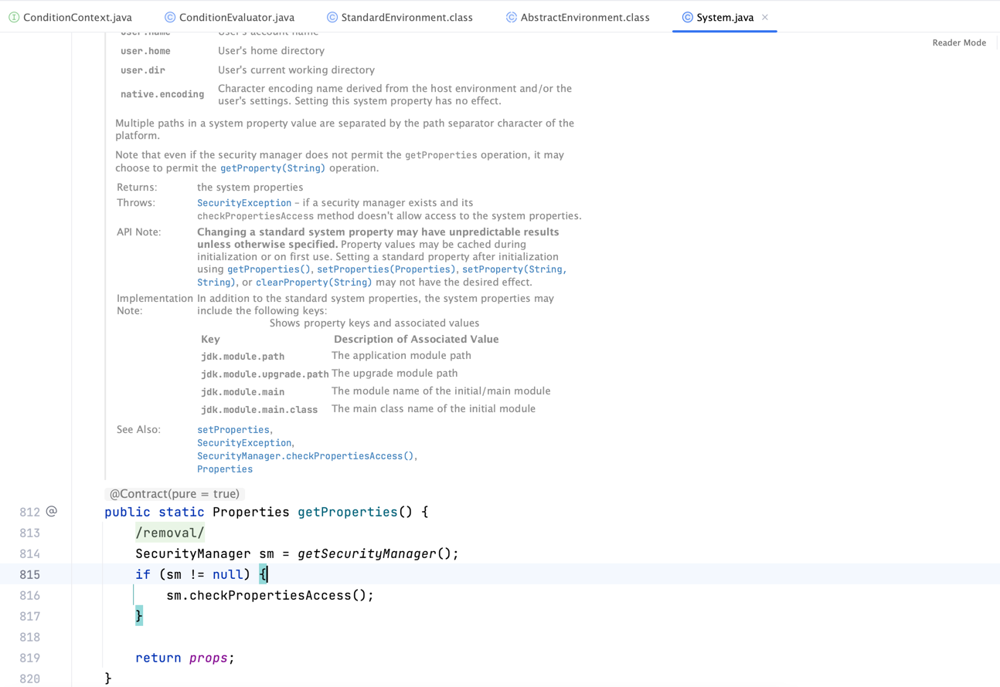

# 今日总结

## 课前分享

- 作业完成情况汇报：自己思考了，也网上查了资料，但是都没有完成
- 分享各自解决问题的思路，重点在思路

## commit log

commit 记录就是课程大纲、学习笔记、复习笔记
同时要有能力根据简短的 commit 历史记录重写出课上讲解的代码

- System.setProperty("k", "v")
- @Conditional
- @BeforeAll + @BeforeEach
- System.setOut(...)

## 练习：寻找从 `WindowsCondition.java` 到 `System.getProperties()` 的通路

锻炼阅读源码的能力

### 通路1

- step1

- step2

- step3

- step4

- step5

- step6

- step7

- step8

### 核心
- 从 `getEnvironment().getProperty()` 跳出到 `getEnvironment()`
- Debug
