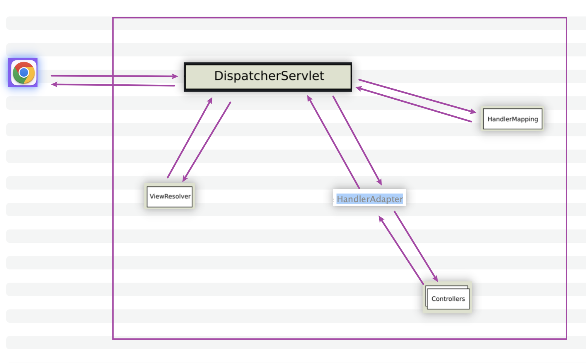

# 今日安排

## 代码演示与点评

- 演示昨天布置的任务
- 点评
- 改进

## 核心代码

- page.show with data
- page.show
- validation + JsonProperty.Access.WRITE_ONLY
- @Email with custom message
- @Email
- Bean Validation
- multi Interceptors
- excludePathPatterns
- addInterceptor
- custom RuntimeException
- @ExceptionHandler
- demo.e
- new t-common-response-p2 module

## 额外强调和练习

- 源码注释阅读
- 理解 SpringMVC 几大模块的协同工作流程

